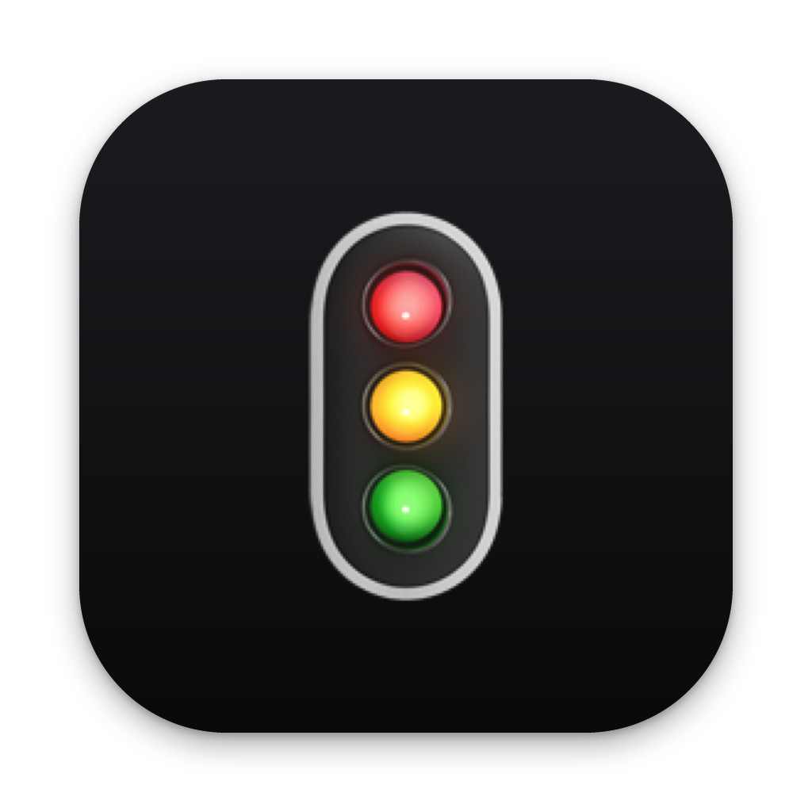

# Claude Code Status Light

<p align="center">
  
</p>

Claude Code Status Light is a macOS menu bar app that shows the live status of one or more Claude Code sessions as small colored lights.

The project is built for developers who keep Claude Code running in a terminal or editor and do not want to constantly switch back just to check whether it is still working, waiting for input, idle, offline, or blocked by an error.

## What it does

- Shows a separate menu bar light for each tracked Claude Code session.
- Uses traffic-light color cues and animation to make the current session state visible at a glance.
- Lets you choose the default round light style or a pixel-art light style from the menu.
- Lets you hover a light to inspect session details such as title, working directory, terminal, current task, message, and update time.
- Lets you click a light to return to the matching terminal window or tab when terminal automation is available.
- Provides a small CLI, `cc-statusctl`, so Claude Code hooks or manual commands can update session status.
- Stores session state locally in JSON files under the user's Application Support directory.

## Status model

| Light | State | Traffic-light cue | Meaning |
| --- | --- | --- | --- |
| Gray | `offline` | No active session | No tracked Claude Code session exists, or the session has exited. |
| Pulsing green | `working` | Green means Claude Code is running | Claude Code is actively running a task and does not need user input. |
| Solid yellow, then slow pulsing yellow after 30s without a response | `waiting` | Yellow means user attention is needed | Claude Code needs user confirmation, authorization, selection, or input. |
| Solid green | `idle` | Green means ready | A session exists and is ready for the next prompt. |
| Red, flashing briefly when it first turns red | `error` | Red means API-level failure | The current turn stopped because of an API-level failure such as rate limiting, authentication, quota, or server errors. |

`working` and `idle` are both green and are distinguished by breathing animation. `waiting` is yellow so it is visually separate from idle/complete, and red is reserved for API-level failures, not for ordinary tool or shell command failures.

When multiple sessions are visible, each session gets its own light. The right-click status summary uses this priority order: `error` > `waiting` > `working` > `idle` > `offline`.

## Requirements

- macOS 11 Big Sur or later
- Swift 5.9 or later
- Xcode Command Line Tools

## Quick start

```bash
# Build
make build

# Run the menu bar app in development
make run

# Package the macOS app and CLI into dist/
make bundle

# Build a distributable .dmg installer into dist/
make dmg

# Install the app into /Applications and the CLI into ~/bin
make install
```

After packaging, `dist/` contains:

- `CC Light.app` - the macOS menu bar app
- `cc-statusctl` - the CLI used to update session status
- `CC-Status-Light-<version>.dmg` - a drag-to-Applications installer (after `make dmg`)

The app runs as a menu bar accessory app, so it does not show a Dock icon.

## Using the menu bar app

| Action | Behavior |
| --- | --- |
| Left click a light | Focus the matching Claude Code terminal session when possible. |
| Hover a light | Show session details and the latest status message. |
| Right click a light | Open the settings and status menu. |
| Option + left click | Open the same menu as right click. |

Terminal focusing is supported for Terminal.app and iTerm2 by matching the TTY. cmux sessions are focused through the `cmux://` URL scheme using the captured workspace and surface IDs, and the app also reads live Claude sessions from cmux's own hook records. Ghostty is matched by working directory because it does not expose TTY information in the same way.

macOS automation permission is required before the app can focus Terminal.app, iTerm2, or Ghostty through AppleScript. cmux focusing uses the `cmux://` URL scheme (opened through LaunchServices) and does not use AppleScript or the cmux socket. The first click may trigger a system permission prompt.

The light style can be changed from the right-click menu. The app keeps the default round style unless you choose the pixel-art light style, and the preference is saved for future launches.

## Using the CLI

```bash
# Set the current session state
cc-statusctl working --task "Build project"
cc-statusctl waiting --message "Approval required"
cc-statusctl idle
cc-statusctl offline --message "Claude Code session exited"
cc-statusctl error --message "API request failed"

# Track a specific Claude Code session
cc-statusctl working \
  --session "$CLAUDE_SESSION_ID" \
  --cwd "$PWD" \
  --title "$(basename "$PWD")"

# Reset to idle
cc-statusctl reset

# Remove a session light
cc-statusctl remove --session "$CLAUDE_SESSION_ID"

# Inspect stored status
cc-statusctl show
cc-statusctl show --session "$CLAUDE_SESSION_ID"
cc-statusctl path
```

When running from source, use `swift run cc-statusctl` instead of `cc-statusctl`.

### CLI options

| Option | Short | Description |
| --- | --- | --- |
| `--message <text>` | `-m` | Extra status message, such as an error or waiting reason. |
| `--task <name>` | `-t` | Current task name. |
| `--session <id>` | `-s` | Session identifier. If omitted, the CLI tries Claude Code environment variables, terminal TTY, then working directory. |
| `--cwd <path>` | | Working directory for the session. |
| `--title <name>` | | Display title shown in hover details. |
| `--terminal-bundle <id>` | | Terminal app bundle identifier, such as `com.googlecode.iterm2`. |
| `--tty <tty>` | | Terminal TTY, such as `/dev/ttys001`, used to focus Terminal.app or iTerm2 sessions. |
| `--cmux-workspace <id>` | | cmux workspace ID or ref used to focus sessions running inside cmux. Auto-detected from `CMUX_WORKSPACE_ID` when available. |
| `--cmux-surface <id>` | | cmux surface/panel ID or ref used to focus sessions running inside cmux. Auto-detected from `CMUX_SURFACE_ID` when available. |
| `--cmux-socket <path>` | | cmux socket path for focusing sessions from outside cmux. Auto-detected from `CMUX_SOCKET_PATH` when available. |

## Local status files

Session state is stored in:

```text
~/Library/Application Support/ClaudeCodeStatusLight/sessions/
```

Each session is represented by one JSON file:

```json
{
  "message": "Build succeeded",
  "sessionID": "session-123",
  "sessionTitle": "cc-status",
  "state": "working",
  "taskName": "Build project",
  "terminalBundleIdentifier": "com.googlecode.iterm2",
  "terminalTTY": "/dev/ttys001",
  "cmuxWorkspaceID": "workspace-id",
  "cmuxSurfaceID": "surface-id",
  "cmuxSocketPath": "/tmp/cmux.sock",
  "updatedAt": "2024-01-01T12:00:00Z",
  "workingDirectory": "/Users/example/Developer/cc-status"
}
```

The menu bar app watches this directory and updates lights in real time. The CLI writes status files, so the app and CLI communicate through local filesystem state rather than a background server.

The app removes stale sessions that have not been updated for more than 24 hours. A normal session shutdown should call `cc-statusctl remove --session "$CLAUDE_SESSION_ID"` to remove the light immediately.

`idle` and `offline` are different:

- `idle` / green: the Claude Code session still exists and is ready for more work.
- `offline` / gray: no active Claude Code session exists, or the user has exited Claude Code.

## Notifications

The app can send system notifications when:

- A session enters `waiting`, meaning Claude Code needs a user decision.
- A session changes to `error`, meaning the turn needs attention.

Notifications can be disabled from the right-click menu.

## Integrating with Claude Code

The intended setup is to call `cc-statusctl` from Claude Code hooks:

```bash
# When a turn starts or before a tool runs
cc-statusctl working --session "$CLAUDE_SESSION_ID" --cwd "$PWD" --title "$(basename "$PWD")"

# When Claude Code needs a user decision
cc-statusctl waiting --session "$CLAUDE_SESSION_ID" --cwd "$PWD" --title "$(basename "$PWD")" --message "User input required"

# When a turn finishes normally
cc-statusctl idle --session "$CLAUDE_SESSION_ID" --cwd "$PWD" --title "$(basename "$PWD")"

# When an API-level failure stops the turn
cc-statusctl error --session "$CLAUDE_SESSION_ID" --cwd "$PWD" --title "$(basename "$PWD")" --message "Request failed"

# When the session exits
cc-statusctl remove --session "$CLAUDE_SESSION_ID"
```

You can also call the CLI manually from a Claude Code session by prefixing commands with `!`.

The recommended way to wire this up is the **"为我自动配置 Hook"** (auto-configure hooks) item in the right-click menu. It writes the hooks into `~/.claude/settings.json` using the **absolute path** to the `cc-statusctl` copy bundled inside the app, so the hooks work even when `cc-statusctl` is not on your `PATH` (for example after installing from the DMG). After installing a new version of the app, re-run the menu item so the hooks point at the new location. Restart Claude Code for the hooks to take effect.

## Development

```bash
make build
make test
make run
make bundle
make install
make clean
```

### Automation permission

Clicking a status light to focus Terminal.app, iTerm2, or Ghostty depends on macOS Automation (TCC) permission because the app uses AppleScript for those terminals. cmux focusing goes through the `cmux://` URL scheme instead.

The bundled `Info.plist` includes `NSAppleEventsUsageDescription`; without it, macOS may silently deny automation from a background menu bar app. The first click may show a prompt asking whether CC Light can control the terminal app.

`make install` uses ad-hoc signing. Reinstalling after rebuilding can make macOS treat the app as a new identity, so automation permission may need to be granted again.

## Project structure

```text
cc-status/
├── Sources/
│   ├── StatusLightCore/        # Shared state model and file store
│   ├── ClaudeCodeStatusLight/  # macOS menu bar app
│   └── CCStatusCtl/            # CLI tool
├── Tests/
│   └── StatusLightCoreTests/
├── Resources/
│   └── Info.plist
├── Package.swift
├── Makefile
└── README.md
```

---

## 中文说明

Claude Code Status Light 是一个 macOS 状态栏红绿灯 App。它通过监控本地 session 状态文件，实时显示一个或多个 Claude Code session 的当前状态。

这个项目主要解决的问题是：当 Claude Code 在终端或编辑器里运行时，开发者不需要频繁切回窗口查看它到底是在工作、等待输入、空闲、离线，还是遇到了错误。

## 功能概览

- 每个 Claude Code session 在状态栏显示一个独立圆形灯。
- 使用交通灯颜色和动画表达当前状态。
- 可在菜单中切换默认圆形灯和像素风格状态灯。
- 鼠标悬停可查看 session 名称/目录、终端、状态、任务/消息和最后更新时间。
- 点击状态灯可回到对应的终端窗口或标签页。
- 提供 `cc-statusctl` 命令行工具，便于 Claude Code hooks 或手动命令更新状态。
- 所有 session 状态都存储在本地 JSON 文件中。

## 状态模型

| 灯色 | 状态值 | 红绿灯指示 | 含义 |
| --- | --- | --- | --- |
| 灰色 | `offline` | 无活跃会话 | 没有可跟踪的 Claude Code session，或 session 已退出。 |
| 绿色闪烁 | `working` | 绿灯表示 Claude Code 正在运行 | Claude Code 正在自动执行任务，不需要用户干预。 |
| 黄色常亮，30 秒未响应后黄色慢呼吸 | `waiting` | 黄灯表示需要用户注意 | Claude Code 需要用户授权、确认、选择或输入。 |
| 绿色常亮 | `idle` | 绿灯表示可继续使用 | 有 Claude Code session，且当前空闲或上次任务已正常完成。 |
| 红色，初次变红时短暂闪烁 | `error` | 红灯表示 API 层错误 | 这一轮对话因 API 错误中断，例如限流、认证失败、额度或服务器错误。 |

`working` 与 `idle` 都是绿色，通过呼吸动画区分；`waiting` 使用黄色，避免与空闲/完成混淆。红灯只表示 API 层错误，不表示普通 shell 命令或工具执行失败。

多个 session 同时存在时，每个 session 独立显示一个灯；右键菜单里的状态汇总按以下优先级展示：`error` > `waiting` > `working` > `idle` > `offline`。

## 快速开始

```bash
# 编译
make build

# 直接运行（调试模式）
make run

# 打包为 macOS App
make bundle

# 生成可分发的 .dmg 安装文件（输出到 dist/）
make dmg

# 安装到 /Applications，并把 CLI 安装到 ~/bin
make install
```

打包后在 `dist/` 目录下会生成：

- `CC Light.app` - 菜单栏 App
- `cc-statusctl` - 命令行工具，也可用 `swift run cc-statusctl`
- `CC-Status-Light-<版本>.dmg` - 拖拽到 Applications 的安装镜像（执行 `make dmg` 后生成）

启动后，菜单栏会出现一个圆形状态灯。默认灰色表示尚未检测到 Claude Code session。App 以 accessory 模式运行，不会显示 Dock 图标。灯样式可在右键菜单中切换为像素风格，选择会在下次启动时保留。

## 使用方法

### 菜单栏操作

| 操作 | 行为 |
| --- | --- |
| 左键点击某个灯 | 直接回到该灯对应的 Claude Code 终端 session。 |
| 悬停某个灯 | 显示 session 名称/目录、终端、状态、任务/消息和最后更新时间。 |
| 右键点击某个灯 | 打开设置菜单。 |
| 按住 Option 后左键点击 | 打开同一个设置菜单。 |

### 多 session 状态灯

每个 Claude Code session 会在状态栏显示一个独立圆形灯，不显示文字。灯色和动画表示该 session 的当前状态；鼠标悬停可查看详情，左键点击会回到正在运行该 Claude Code session 的终端窗口或标签页：

- iTerm2 / Terminal.app：按终端 TTY 精确定位窗口或标签页。
- cmux：通过 `cmux://` 深链接按 workspace 和 surface 精确定位面板。
- Ghostty：按 session 工作目录匹配终端并 focus，因为 Ghostty 未暴露 TTY。

如果没有 session，会显示一个灰灯占位；右键仍然可打开设置菜单。

### 右键菜单选项

| 菜单项 | 说明 |
| --- | --- |
| 当前状态 | 显示右键点击灯对应 session 的名称、状态、更新时间、任务/消息、目录/终端，以及 session 总数。 |
| 重置此 session 为绿灯 | 将右键点击的 session 重置为 `idle`。 |
| 清除所有错误 | 将所有红灯 session 重置为 `idle`。 |
| 在登录时启动 | 添加或移除 LaunchAgent，实现开机自启。 |
| 启用通知 | 切换系统通知开关。 |
| 灯样式 | 在默认圆形灯和像素风格状态灯之间切换。 |
| 打开 Claude Code 上下文 | 切回当前选中 session 所属的终端 App/面板。 |
| 退出 | 退出 App，会二次确认。 |

## 使用 CLI 更新状态

```bash
# 设置状态
cc-statusctl working --task "编译 main.go"
cc-statusctl waiting --message "需要确认危险操作"
cc-statusctl idle
cc-statusctl offline --message "Claude Code session 已退出"
cc-statusctl error --message "API 请求失败"

# 指定 session，推荐用于多个 Claude Code session
cc-statusctl working \
  --session "$CLAUDE_SESSION_ID" \
  --cwd "$PWD" \
  --title "$(basename "$PWD")"

# 重置为绿色，等价于 cc-statusctl idle
cc-statusctl reset

# 移除某个 session 的灯
cc-statusctl remove --session "$CLAUDE_SESSION_ID"

# 查看状态
cc-statusctl show
cc-statusctl show --session "$CLAUDE_SESSION_ID"
cc-statusctl path
```

未打包时，用 `swift run cc-statusctl` 代替 `cc-statusctl`。

### CLI 选项

| 选项 | 缩写 | 说明 |
| --- | --- | --- |
| `--message <文本>` | `-m` | 附加消息，例如错误信息或等待原因。 |
| `--task <任务名>` | `-t` | 当前任务名称。 |
| `--session <ID>` | `-s` | session 标识；未提供时依次使用 Claude session 环境变量、当前终端 TTY、当前工作目录。 |
| `--cwd <路径>` | | session 对应的工作目录。 |
| `--title <名称>` | | session 在 hover 详情中的显示名称。 |
| `--terminal-bundle <ID>` | | 终端 App 的 bundle identifier，例如 `com.googlecode.iterm2`。 |
| `--tty <TTY>` | | 终端 TTY，例如 `/dev/ttys001`，用于点击灯时回到具体窗口或标签页。 |
| `--cmux-workspace <ID>` | | cmux workspace ID 或 ref；在 cmux 中会自动从 `CMUX_WORKSPACE_ID` 读取。 |
| `--cmux-surface <ID>` | | cmux surface/panel ID 或 ref；在 cmux 中会自动从 `CMUX_SURFACE_ID` 读取。 |
| `--cmux-socket <路径>` | | cmux socket 路径；在 cmux 中会自动从 `CMUX_SOCKET_PATH` 读取。 |

`cc-statusctl` 会自动尝试从 `TERM_PROGRAM`、`TTY`、`SSH_TTY` 和 `tty` 命令推断终端信息；在 cmux 中还会自动读取 `CMUX_WORKSPACE_ID`、`CMUX_SURFACE_ID` 和 `CMUX_SOCKET_PATH`。hook 子进程里 `tty` 通常失效时，会沿父进程链用 `ps` 找回控制终端。Ghostty 通过工作目录定位窗口，无需 TTY。

## 状态文件

多 session 状态文件位于：

```text
~/Library/Application Support/ClaudeCodeStatusLight/sessions/
```

每个 session 一个 JSON 文件：

```json
{
  "message": "编译成功",
  "sessionID": "session-123",
  "sessionTitle": "cc-status",
  "state": "working",
  "taskName": "构建项目",
  "terminalBundleIdentifier": "com.googlecode.iterm2",
  "terminalTTY": "/dev/ttys001",
  "cmuxWorkspaceID": "workspace-id",
  "cmuxSurfaceID": "surface-id",
  "cmuxSocketPath": "/tmp/cmux.sock",
  "updatedAt": "2024-01-01T12:00:00Z",
  "workingDirectory": "/Users/example/Developer/cc-status"
}
```

多个进程通过此目录共享状态：App 监控目录变更实时更新灯色，CLI 工具按 session 写入新状态。App 和 CLI 不需要同时启动；可以只用 CLI 写入状态，由 App 负责显示。

状态更新会保留已有的终端定位信息。App 启动时会清理超过 24 小时未更新的残留 session。`SessionEnd` 正常退出时应立即调用 `cc-statusctl remove --session "$CLAUDE_SESSION_ID"` 移除对应灯。

`idle` 和 `offline` 的区别：

- `idle` / 绿灯：Claude Code session 仍然存在，只是当前没有任务，可以继续发新任务。
- `offline` / 灰灯：没有活跃 Claude Code session，或用户已经退出 Claude Code。

## 通知

App 自动推送系统通知的场景：

- 进入 `waiting`：Claude Code 需要你回到终端做选择。
- 任意状态变为 `error`：这轮对话因 API 层错误中断，需要关注。

可在右键菜单中关闭通知。

## 与 Claude Code 集成

推荐将 `cc-statusctl` 与 Claude Code hooks 结合，自动更新状态：

```bash
# 任务开始或工具执行前
cc-statusctl working --session "$CLAUDE_SESSION_ID" --cwd "$PWD" --title "$(basename "$PWD")"

# 需要用户决策
cc-statusctl waiting --session "$CLAUDE_SESSION_ID" --cwd "$PWD" --title "$(basename "$PWD")" --message "请确认后续操作"

# 任务正常结束
cc-statusctl idle --session "$CLAUDE_SESSION_ID" --cwd "$PWD" --title "$(basename "$PWD")"

# API 层错误导致本轮中断
cc-statusctl error --session "$CLAUDE_SESSION_ID" --cwd "$PWD" --title "$(basename "$PWD")" --message "请求失败"

# Claude Code session 退出
cc-statusctl remove --session "$CLAUDE_SESSION_ID"
```

也可以在 Claude Code 会话中按需手动调用：

```bash
!cc-statusctl working --task "重构用户模块"
!cc-statusctl waiting --message "请确认接口变更"
!cc-statusctl error --message "API 请求失败"
!cc-statusctl idle
!cc-statusctl offline --message "Claude Code session 已退出"
```

在 Claude Code 中，以 `!` 开头的命令会直接在终端执行。

## 开发

```bash
make build
make test
make run
make bundle
make install
make clean
```

### 自动化授权

点击状态灯回到 Terminal.app、iTerm2 或 Ghostty 窗口依赖 macOS 自动化（TCC）授权，因为 App 会通过 AppleScript 控制这些终端。cmux 聚焦通过 `cmux://` 深链接完成，不走 AppleScript，也不需要 cmux socket。

本项目的 `Info.plist` 已包含 `NSAppleEventsUsageDescription`，否则后台菜单栏 App 可能会被系统静默拒绝且不弹授权框。首次点灯时，系统可能会弹出授权请求。

`make install` 使用 ad-hoc 签名。由于 ad-hoc 的签名标识每次重新编译都可能变化，重新安装后通常需要再次授权。

## 项目结构

```text
cc-status/
├── Sources/
│   ├── StatusLightCore/        # 核心库：状态模型和状态文件读写
│   ├── ClaudeCodeStatusLight/  # 菜单栏 App
│   └── CCStatusCtl/            # CLI 工具
├── Tests/
│   └── StatusLightCoreTests/
├── Resources/
│   └── Info.plist
├── Package.swift
├── Makefile
└── README.md
```
